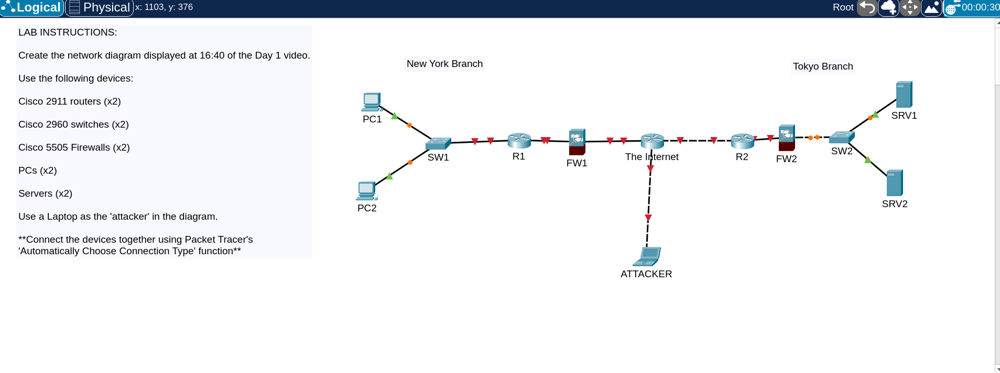

# Cisco Packet Tracer Labs

Daily Packet Tracer labs and exercises — networking fundamentals, configuration practice, and topology builds.

---

## Day 01 — Packet Tracer Introduction



---

## Day 02 — Connecting Devices


---

## Structure

```
Day 01 — Packet Tracer Introduction
Day 02 — Connecting Devices
...
```

Each `.pkt` file is a standalone Packet Tracer project. Open with [Cisco Packet Tracer](https://www.netacad.com/courses/packet-tracer).

---

## Progress

| Day | Topic | Status |
|---|---|---|
| 01 | Packet Tracer Introduction | ✅ |
| 02 | Connecting Devices | ✅ |

---

Built by [Nova (Abdur Rahman Khan)](https://github.com/AbdurRahman-cybersec) — M.S. Cybersecurity student, SOC Analyst at USCA.
